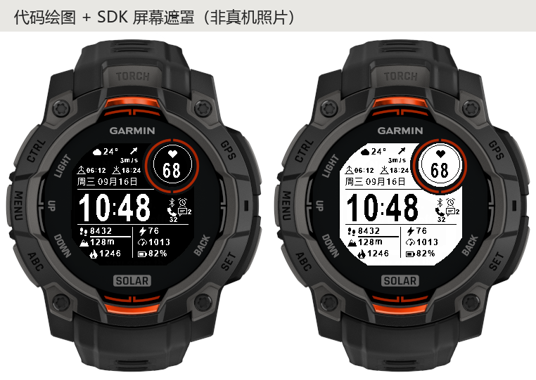

# FIELD · 本能 3 Solar 图标表盘

为 **Garmin Instinct 3 Solar 50mm** 实现的 Monkey C 表盘。Garmin SDK 将 45mm / 50mm 合并为设备 ID `instinct3solar45mm`，不是选错了尺寸。真实显示区为 176×176、1-bit 单色，适配右上固定小窗和切角边界。



这是从 **模拟器实际执行的绘图命令** 与随包字体重建的像素预览，并叠加 SDK 设备遮罩；不是 AI 效果图，也不是真机截图。所有文字宽度经过 Garmin Graphics.Dc 验证。

## 安装和设置

1. 可安装文件：`bin/field-release.prg`。不要把 `field-preview.prg` 装到日常使用的手表上；preview 使用固定演示数据。
2. USB 连接手表，打开手表存储，将发布版复制到 `GARMIN/APPS/`，可命名为 `FIELD.prg`。
3. 安全断开连接，在手表表盘选择菜单中选择 FIELD。
4. 在该表盘的设置/自定义入口进入手表端菜单，可调整主题、槽位数量、每槽指标、小窗指标、秒数和读取间隔。具体菜单名称随固件语言而异。
5. 项目也包含 Connect IQ 配置资源；通过正式 Connect IQ 渠道安装后可以用配套设置编辑器。当前未发布到商店，不承诺侧载应用会出现在手机端设置列表。

数据为空时显示 `--`，日出日落缺失时显示 `--:--`。先同步 Garmin Connect 天气并确保天气位置可用；程序不使用演示数据填补正式版的缺失值。

## 布局与配置

只有日期使用中文。时间固定 24 小时制，其余内容使用图标、数字和必要单位。

- 顶部：天气、温度、8 向风向箭头、风速、日出、日落。
- 小窗：默认心率，可换成任意非空指标；长数值自动使用较小字体。
- 时间右侧：手机蓝牙连接、已设置闹钟、手机连接、通知图标及数量（超过 9 显示 `+`）；无通知时可显示勿扰月亮图标。
- 底部：4 / 6 / 8 槽位，逐行从左到右编号。每槽可以换指标、重复指标或留空；减少槽位时保留隐藏槽位的配置。
- 默认六槽：步数 / 身体电量、海拔 / 环境气压、总热量 / 手表电量。
- 4 / 6 槽支持步数进度线，8 槽使用 11px 图标和 9px 数字以保证行距。
- 支持黑底白字、白底黑字；表盘内中文日期使用内置的小字形子集，不依赖设备是否装有中文系统字体。手表端设置菜单采用设备系统字体。

可选指标共 18 种：步数、身体电量、海拔、环境气压、总热量、手表电量、心率、距离、压力、血氧、天气温度、湿度、降水概率、风速、通知数、今日强度分钟、日出、日落。

**单位**：海拔 m、环境气压 hPa、总热量 kcal、距离 km（屏幕简写 `k`）、温度 ℃、风速 m/s。数字超过四位时可能简写为 `k` / `M`；短槽位优先缩小字号，仍无法容纳时显示 `--`，不越界绘制。

身体电量用闪电图标，手表电量用电池图标。电话图标仅表示手机已连接，**不表示通话中或未接来电**；公开表盘接口没有可靠的该类状态。通知数字是系统提供的活动通知数量。

## 低负荷策略

- 不启动 GPS，不订阅连续传感器，不创建后台服务、联网轮询或独立刷新定时器。
- 只有 `Positioning` 与 `SensorHistory` 权限。位置权限用于读取天气缓存中的观测位置，以计算日出/日落；不会主动申请 GPS 定位。
- 指标默认 60 秒读取一次，可选 120 / 300 秒；只读取当前显示槽位及小窗需要的传感器。重复指标只读一次，每次只取最新一条历史样本。
- 天气读取系统缓存，默认每 15 分钟一次，可选 5 / 30 / 60 分钟；超过两小时的天气观测失效。
- 日出日落仅在本地日期、时区或天气位置约 1 km 网格改变时重新计算；无位置/极昼极夜时允许缺失。
- 字体与 41 个图标在电脑上生成，运行时使用 1-bit 字形资源；不加载完整中文字体，不执行 SVG 解析、图像缩放或三角函数图标绘制。
- 常规数据处理最多每分钟进行一次；唤醒/配置变化时允许额外处理。未变化的秒级回调不整屏重绘。
- 默认秒数只在抬腕唤醒期间显示，也可关闭或常显。常显秒数仅更新 **24×9 = 216 像素**，该路径不读取传感器、天气、设置或重排布局。
- 收到 `onPowerBudgetExceeded` 后停止常显秒数，直到应用重新启动。其余时间和数据保持工作。
- 设置只在选择新值时保存；不会每秒/每分钟写入存储。

样本有效期：心率 5 分钟，身体电量/海拔/环境气压/压力 15 分钟，血氧 30 分钟。血氧并非连续测量，白天空白是正常情况。步数与热量为设备日累计值；日切时立即重新读取。

## 构建与验证

依赖 Garmin Connect IQ SDK、对应设备包、Java。已生成的字体/图标可直接编译；重新生成资源需 Python + Pillow。

```powershell
# SDK 默认从当前用户 Garmin/ConnectIQ/current-sdk.cfg 读取
./tools/build.ps1 -Mode release

# 可显式提供工具路径和自己的开发签名密钥
./tools/build.ps1 -Sdk C:/path/to/sdk -Java C:/path/to/java.exe -Key C:/path/to/developer_key.der

# 真正运行 Garmin 模拟器单元测试
./tools/build.ps1 -Mode test -Run *> .local/test-output.log
python tools/render_trace.py
python tools/verify_assets.py

# 固定数据演示版 / 使用真实系统 API 的性能诊断版
./tools/build.ps1 -Mode preview -Run
./tools/build.ps1 -Mode diagnostic -Run
```

首次构建如未提供密钥，脚本用 OpenSSL 生成本机开发用 PKCS8 密钥，放在 `.local/`，该目录已忽略。不要将私钥放入发布包或源码提交。已存在的密钥不会被覆盖。

`tools/generate_assets.py` 可用 `--latin` / `--cjk` 指定本机字体路径；默认使用 Windows Arial Bold 和微软雅黑。修改图标/字体后需要重新编译测试，然后重建像素预览。

## 扩展新指标或图标

1. 在 `config/metrics.json` **末尾追加**稳定 ID、标识、中文设置名称、图标与单位。不要重排已有 ID，否则用户已保存的配置会错位。
2. 在 `tools/generate_assets.py` 的 `NAMES` 与 `icon()` 中追加图标。生成器会同时产生 13px / 11px 单色字形、图标目录及 Monkey C 常量。
3. 在 `DataModel.refreshLive()` 中添加受 `config.needed[id]` 控制的数据来源，并处理缺失值、单位转换和新鲜度；有特殊格式时扩展 `Format.metric()`。
4. 执行 `python tools/generate_assets.py`。它会同步生成应用属性、手机设置资源、手表端菜单目录和指标常量。
5. 运行模拟器测试与 `verify_assets.py`，检查新指标在 4 / 6 / 8 槽、小窗及真实遮罩内均可读。

天气映射位于 `WeatherIcons.mc`，覆盖 Garmin 的全部 54 个 condition 编号；未知编号回退问号，晴天支持昼夜图标切换。

## 验证范围

已通过目标设备编译、Garmin 模拟器测试、六种布局字体宽度与 SDK 屏幕遮罩检查。见 `docs/validation.md`。

尚未连接真实手表验证安装、固件菜单入口或长期续航。模拟器耗时不能直接换算为真机电池寿命。

参考：[设备规格](https://developer.garmin.com/connect-iq/device-reference/instinct3solar45mm/)、[局部刷新预算](https://developer.garmin.com/connect-iq/connect-iq-faq/how-do-i-get-my-watch-face-to-update-every-second/)、[天气接口](https://developer.garmin.com/connect-iq/api-docs/Toybox/Weather.html)、[传感器历史](https://developer.garmin.com/connect-iq/api-docs/Toybox/SensorHistory.html)。
